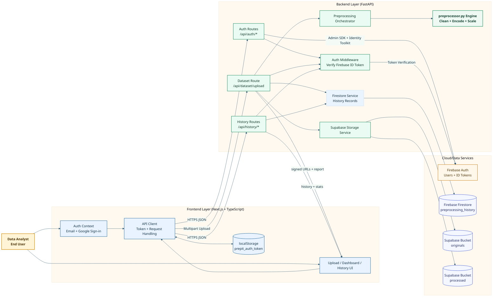

# PrepIt PPT-Friendly Architecture (Mermaid)

Use this in Mermaid Live Editor and export as SVG/PNG for PowerPoint.

```mermaid
%%{init: {
  "theme": "base",
  "themeVariables": {
    "fontFamily": "Trebuchet MS, Segoe UI, Arial",
    "fontSize": "17px",
    "lineColor": "#29526d",
    "primaryColor": "#eaf4ff",
    "primaryTextColor": "#0e2a3a",
    "secondaryColor": "#f4fbf7",
    "tertiaryColor": "#fff9ef"
  },
  "flowchart": {
    "rankSpacing": 88,
    "nodeSpacing": 72,
    "curve": "basis",
    "htmlLabels": true
  }
}}%%
flowchart LR

U[Data Analyst<br/>End User]

subgraph FE["Frontend Layer (Next.js + TypeScript)"]
direction TB
FE1[Auth Context<br/>Email + Google Sign-in]
FE2[Upload / Dashboard / History UI]
FE3[API Client<br/>Token + Request Handling]
FE4[(localStorage<br/>prepit_auth_token)]
FE1 --> FE3
FE2 --> FE3
FE3 <--> FE4
end

subgraph BE["Backend Layer (FastAPI)"]
direction TB
BE1[Auth Routes<br/>/api/auth/*]
BE2[Dataset Route<br/>/api/dataset/upload]
BE3[History Routes<br/>/api/history/*]
BE4[Auth Middleware<br/>Verify Firebase ID Token]
BE5[Preprocessing Orchestrator]
BE6[preprocessor.py Engine<br/>Clean + Encode + Scale]
BE7[Firestore Service<br/>History Records]
BE8[Supabase Storage Service]
BE1 --> BE4
BE2 --> BE4
BE3 --> BE4
BE2 --> BE5 --> BE6
BE2 --> BE8
BE2 --> BE7
BE3 --> BE7
end

subgraph CLD["Cloud/Data Services"]
direction TB
C1[Firebase Auth<br/>Users + ID Tokens]
C2[(Firebase Firestore<br/>preprocessing_history)]
C3[(Supabase Bucket<br/>originals)]
C4[(Supabase Bucket<br/>processed)]
end

U --> FE1
U --> FE2

FE3 -- HTTPS JSON --> BE1
FE3 -- Multipart Upload --> BE2
FE3 -- HTTPS JSON --> BE3

BE1 -- Admin SDK + Identity Toolkit --> C1
BE4 -- Token Verification --> C1
BE7 --> C2
BE8 --> C3
BE8 --> C4

BE2 -- signed URLs + report --> FE2
BE3 -- history + stats --> FE2

classDef actor fill:#fff4d6,stroke:#d08b00,stroke-width:2px,color:#4a2f00,font-weight:bold;
classDef front fill:#e8f3ff,stroke:#2f6f9f,stroke-width:1.6px,color:#0d2c42;
classDef back fill:#e9fbf2,stroke:#1e8b5f,stroke-width:1.6px,color:#0b3323;
classDef cloud fill:#fff7ea,stroke:#c9821f,stroke-width:1.6px,color:#4a2f00;
classDef db fill:#f4f7ff,stroke:#5a6fd8,stroke-width:1.6px,color:#1e2a66;
classDef process fill:#eef9f3,stroke:#2d9c6f,stroke-width:2px,color:#114131,font-weight:bold;

class U actor;
class FE1,FE2,FE3,FE4 front;
class BE1,BE2,BE3,BE4,BE5,BE8 back;
class BE6 process;
class C1 cloud;
class C2,C3,C4 db;
```

Recommended export size for PPT (16:9): 1920x1080 or SVG.
