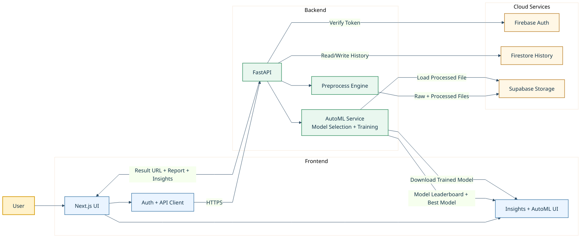

# PrepIt One-Slide Compact Architecture (Mermaid)

```mermaid
%%{init: {
  "theme": "base",
  "themeVariables": {
    "fontFamily": "Segoe UI, Arial",
    "fontSize": "16px",
    "lineColor": "#2e4d66",
    "primaryColor": "#eef6ff",
    "primaryTextColor": "#0f2f45"
  },
  "flowchart": {
    "rankSpacing": 60,
    "nodeSpacing": 45,
    "curve": "linear"
  }
}}%%
flowchart LR

U[User]

subgraph FE[Frontend]
F1[Next.js UI]
F2[Auth + API Client]
F3[Insights + AutoML UI]
F1 --> F2
F1 --> F3
end

subgraph BE[Backend]
B1[FastAPI]
B2[Preprocess Engine]
B3[AutoML Service<br/>Model Selection + Training]
B1 --> B2
B1 --> B3
end

subgraph DS[Cloud Services]
D1[Firebase Auth]
D2[Firestore History]
D3[Supabase Storage]
end

U --> F1
F2 -->|HTTPS| B1
B1 -->|Verify Token| D1
B1 -->|Read/Write History| D2
B2 -->|Raw + Processed Files| D3
B3 -->|Load Processed File| D3
B3 -->|Model Leaderboard + Best Model| F3
B3 -->|Download Trained Model| F3
B1 -->|Result URL + Report + Insights| F1

classDef actor fill:#fff2cc,stroke:#d49800,stroke-width:1.8px;
classDef front fill:#eaf4ff,stroke:#3c78a8,stroke-width:1.4px;
classDef back fill:#e9f7ef,stroke:#2b8a5a,stroke-width:1.4px;
classDef data fill:#fff7e6,stroke:#b7791f,stroke-width:1.4px;
class U actor;
class F1,F2,F3 front;
class B1,B2,B3 back;
class D1,D2,D3 data;
```

Suggested export for PPT: SVG (best) or PNG `1600x900`.
