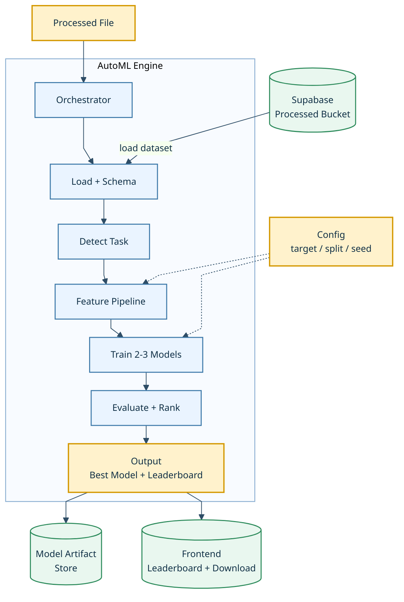

# PrepIt AutoML Engine - Balanced One Slide

```mermaid
%%{init: {
  "theme": "base",
  "themeVariables": {
    "fontFamily": "Segoe UI, Arial",
    "fontSize": "13px",
    "lineColor": "#2e4d66",
    "primaryColor": "#eef6ff",
    "primaryTextColor": "#0f2f45"
  },
  "flowchart": {
    "rankSpacing": 26,
    "nodeSpacing": 22,
    "curve": "linear"
  }
}}%%
flowchart TB

I[Processed File]
C[Config<br/>target / split / seed]

subgraph A[AutoML Engine]
direction TB
M0[Orchestrator]
M1[Load + Schema]
M2[Detect Task]
M3[Feature Pipeline]
M4[Train 2-3 Models]
M5[Evaluate + Rank]
O[Output<br/>Best Model + Leaderboard]
M0 --> M1 --> M2 --> M3 --> M4 --> M5 --> O
end

S1[(Supabase<br/>Processed Bucket)]
S2[(Model Artifact<br/>Store)]
S3[(Frontend<br/>Leaderboard + Download)]

I --> M0
C -.-> M3
C -.-> M4
S1 -->|load dataset| M1
O --> S2
O --> S3

classDef io fill:#fff2cc,stroke:#d49800,stroke-width:1.8px;
classDef stage fill:#eaf4ff,stroke:#3c78a8,stroke-width:1.4px;
classDef store fill:#e9f7ef,stroke:#2b8a5a,stroke-width:1.4px;
style A fill:#f8fbff,stroke:#8aaed1,stroke-width:1.2px;
class I,O,C io;
class M0,M1,M2,M3,M4,M5 stage;
class S1,S2,S3 store;
```

Recommended export: SVG or PNG `1920x1080`.
