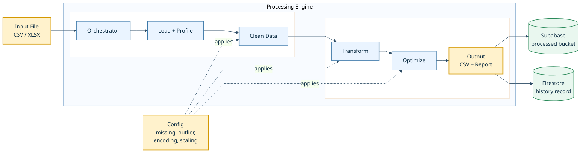

# PrepIt Processing Engine - Balanced One Slide

```mermaid
%%{init: {
  "theme": "base",
  "themeVariables": {
    "fontFamily": "Segoe UI, Arial",
    "fontSize": "15px",
    "lineColor": "#2e4d66",
    "primaryColor": "#eef6ff",
    "primaryTextColor": "#0f2f45"
  },
  "flowchart": {
    "rankSpacing": 36,
    "nodeSpacing": 32,
    "curve": "linear"
  }
}}%%
flowchart LR

I[Input File<br/>CSV / XLSX]
C[Config<br/>missing, outlier,<br/>encoding, scaling]

subgraph E[Processing Engine]
direction TB
subgraph T1[" "]
direction LR
P0[Orchestrator] --> P1[Load + Profile] --> P2[Clean Data]
end
subgraph T2[" "]
direction LR
P3[Transform] --> P4[Optimize] --> O[Output<br/>CSV + Report]
end
P2 --> P3
end

S1[(Supabase<br/>processed bucket)]
S2[(Firestore<br/>history record)]

I --> P0
C -.applies.-> P2
C -.applies.-> P3
C -.applies.-> P4
O --> S1
O --> S2

classDef io fill:#fff2cc,stroke:#d49800,stroke-width:1.8px;
classDef stage fill:#eaf4ff,stroke:#3c78a8,stroke-width:1.4px;
classDef store fill:#e9f7ef,stroke:#2b8a5a,stroke-width:1.4px;
style E fill:#f8fbff,stroke:#8aaed1,stroke-width:1.2px;
class I,O,C io;
class P0,P1,P2,P3,P4 stage;
class S1,S2 store;
```

Recommended export: SVG or PNG `1600x900`.
