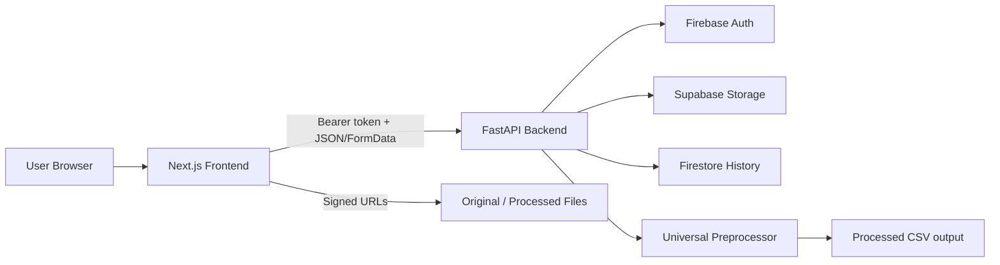

# PrepIt

PrepIt is an end-to-end data preprocessing platform for machine learning workflows. It combines a FastAPI backend, a Next.js frontend, a universal preprocessing engine, Firebase Authentication, Supabase storage, and Firestore-based history tracking into a single product that turns raw CSV or Excel files into cleaned, model-ready datasets.

This repository contains the full stack implementation plus a set of supporting technical notes. This document is the canonical project overview: it explains what the system does, how the pieces fit together, how data flows through the platform, how the preprocessing engine behaves, and how to run the project in development or production.

## What PrepIt Solves

Preparing data for machine learning is usually repetitive and error-prone. Real datasets arrive with missing values, duplicate rows, inconsistent types, outliers, messy categorical values, and time-series fields that need special handling. PrepIt automates the boring parts of that workflow and exposes the result through a web application.

The platform is designed for the following use cases:

- Cleaning tabular datasets before training.
- Uploading CSV, XLS, or XLSX files through a browser.
- Automatically detecting column types and applying sensible preprocessing rules.
- Generating a cleaned output file plus a detailed processing report.
- Storing original and processed files for later download.
- Keeping per-user processing history and summary statistics.
- Providing a frontend dashboard for upload, inspection, and history management.

At a technical level, PrepIt is built around a single preprocessing pipeline and several service layers that wrap it with authentication, storage, history, and UI.

## High-Level Architecture

The project is organized into three major subsystems:

1. A Next.js frontend in [Frontend/](Frontend) for user interaction.
2. A FastAPI backend in [backend/](backend) for authentication, uploads, history, and orchestration.
3. A universal preprocessing engine in [Preprocess/preprocessor.py](Preprocess/preprocessor.py) for dataset cleaning and feature engineering.

The backend currently integrates with Firebase Authentication, Firestore, and Supabase Storage. The frontend uses Firebase client-side configuration, a local token store, and a REST client that talks to the backend. The preprocessing engine is intentionally reusable and can also be invoked from the command line.



## Repository Layout

The repository is split by responsibility rather than by deployment target.

### Root Level

- [README.md](README.md) - this document.
- [QUICK_START.md](QUICK_START.md) - concise setup instructions.
- [test-auth.html](test-auth.html) - local auth testing helper.
- Model artifacts such as `.keras` files and generated outputs used during experimentation.

### Backend

- [backend/app/main.py](backend/app/main.py) - FastAPI application entrypoint.
- [backend/app/routes/](backend/app/routes) - route modules for auth, dataset upload, and history.
- [backend/app/services/](backend/app/services) - storage, Firestore, analytics, and preprocessing orchestration.
- [backend/app/utils/](backend/app/utils) - Firebase config, auth middleware, file validation, and related helpers.
- [backend/app/models/](backend/app/models) - Pydantic request and response models.
- [backend/requirements.txt](backend/requirements.txt) - Python dependencies.
- [backend/.env.example](backend/.env.example) - backend configuration template.

### Frontend

- [Frontend/app/](Frontend/app) - Next.js App Router pages.
- [Frontend/components/](Frontend/components) - shared UI and feature components.
- [Frontend/context/](Frontend/context) - React context providers such as theme and auth state.
- [Frontend/lib/](Frontend/lib) - API client, Firebase client setup, and utility helpers.
- [Frontend/package.json](Frontend/package.json) - frontend scripts and dependencies.
- [Frontend/.env.example](Frontend/.env.example) - frontend configuration template.

### Preprocessing

- [Preprocess/preprocessor.py](Preprocess/preprocessor.py) - universal preprocessing pipeline.
- [Preprocess/README.md](Preprocess/README.md) - preprocessing module-specific guide.
- Sample datasets and processed outputs for local experimentation.

## Product Story

PrepIt is a web-first data preparation platform. A user signs in, uploads a dataset, configures a few preprocessing options if needed, waits for the backend to clean the file, and then downloads the processed result. Every operation is recorded in history so the user can revisit previous runs and compare outcomes.

The platform is deliberately split between a reusable data engine and web application plumbing. That separation is important:

- The preprocessing engine is deterministic and testable on its own.
- The backend provides secure access, file storage, and history.
- The frontend provides a guided workflow and a dashboard for everyday use.

This makes it easier to debug, extend, and deploy each layer independently.

## Why This Project Matters

PrepIt is important because it collapses several expensive manual steps in data preparation into a single repeatable pipeline. In practical terms, it reduces the time between raw data collection and machine-learning experimentation, and it does so in a way that is auditable, reversible, and user-scoped.

The project is technically valuable for four reasons:

- It demonstrates how to turn a standalone preprocessing script into a production workflow.
- It separates data logic from web concerns, making the system easier to test and maintain.
- It combines secure authentication, file storage, and history tracking around a shared preprocessing core.
- It creates a foundation for AI-assisted preprocessing without sacrificing the deterministic pipeline that already exists.

For teams working on data science products, this is the difference between an offline utility and an end-user platform.

## Technical Concepts and Methodology

The project uses a layered architecture and a pipeline methodology. The main idea is that raw data should pass through a series of controlled transformation stages, each with a narrow responsibility and a predictable output.

### Architectural Concepts

- Separation of concerns: frontend, backend, preprocessing, storage, and identity are isolated into distinct layers.
- Orchestration pattern: the backend coordinates services rather than embedding preprocessing logic directly in route handlers.
- Black-box engine design: the preprocessing module can be called from the backend or the command line without knowing the surrounding web implementation.
- Stateless request handling: upload requests carry the minimum data required for processing, and persistent state is kept in storage and history systems.
- User-scoped data access: every file, token, and history record is tied to a specific authenticated user.
- Signed URL distribution: the system shares access to stored files without exposing storage credentials.

### Data-Engineering Methodology

- Validate early: reject unsafe or invalid uploads before they reach the pipeline.
- Profile before transforming: infer column types and dataset structure before performing cleaning decisions.
- Transform deterministically: apply the same preprocessing rules to the same data and configuration.
- Preserve provenance: keep original file references, processed file references, and a full report for auditing.
- Prefer graceful degradation: if one subsystem fails, preserve whatever results are already valid.
- Keep the report first-class: the processing report is treated as an output artifact, not as a debug log.

### ML Readiness Concepts

- Missing-value strategy selection.
- Outlier handling using robust statistics.
- Type-aware encoding for categorical variables.
- Feature scaling based on distribution shape.
- Feature engineering for time-series and ratio-based analysis.
- Metadata retention for reproducibility and traceability.

These concepts matter because a preprocessing system is only useful when it produces datasets that are stable enough for model training and still explainable enough for downstream review.

## Core User Flows

### 1. Sign Up and Sign In

Users create an account with email and password or log in with existing credentials. The backend delegates identity management to Firebase Authentication. The frontend stores the returned ID token in local storage under `prepit_auth_token` and sends it as a Bearer token for protected requests.

### 2. Upload a Dataset

The upload page accepts CSV, XLS, and XLSX files. The frontend can preview the file locally, then submits the binary file and preprocessing options to the backend using `multipart/form-data`.

### 3. Preprocess the Data

The backend validates the upload, stores the original file in Supabase, runs the preprocessing pipeline, stores the cleaned output, and writes a history record in Firestore.

### 4. Review the Result

The backend returns signed URLs for the original and processed files plus a structured preprocessing report. The frontend displays processing status, statistics, and download actions.

### 5. Review History

Users can browse previous runs, inspect details, and remove history entries. Each record is protected so one user cannot access another user’s files or processing history.

### 6. Beta AI Chatbot Assisted Processing

PrepIt now includes a beta AI chatbot feature that lets the user describe the desired transformation in natural language while attaching a dataset. The system sends the prompt and the file to an online AI API, then uses the AI response to guide or produce the processed output and the final response payload.

This beta flow is intentionally presented as an assisted-processing path rather than a replacement for the core preprocessing engine.

#### Beta Flow

1. The user uploads a file and enters a natural-language prompt.
2. The frontend forwards the prompt and file to the backend.
3. The backend sends the prompt and dataset context to an online AI API.
4. The AI response is interpreted as processing guidance or a generated transformation result.
5. The backend produces the processed file and a response summary.
6. The frontend shows the generated output and any AI-provided explanation.

#### Beta-Feature Characteristics

- The feature is marked beta because model behavior can vary by prompt and file shape.
- The output may depend on the external AI service’s response quality and availability.
- The system should still preserve the deterministic preprocessing pipeline as the fallback path.
- Sensitive data handling should be reviewed before enabling the beta feature in production.
- AI output should be validated before it is treated as a final processed artifact.

#### Why Add the AI Chatbot

The chatbot makes PrepIt more accessible to non-technical users. Instead of forcing users to understand preprocessing terminology, the system allows intent-based interaction such as "remove noisy columns," "prepare for regression," or "clean and standardize this dataset." That lowers the activation barrier while keeping the underlying pipeline available for consistent execution.

## Backend Overview

The backend is a FastAPI application with a focused responsibility: secure orchestration around preprocessing.

The application entrypoint is [backend/app/main.py](backend/app/main.py). It does the following:

- Initializes Firebase during startup.
- Configures CORS.
- Registers the auth, dataset, and history routers.
- Exposes a root health-style endpoint and a dedicated `/health` endpoint.
- Disables OpenAPI docs in production mode.

### Backend Technology Stack

- FastAPI for HTTP APIs.
- Pydantic for request and response models.
- Firebase Admin SDK for authentication and identity verification.
- Firebase REST API calls for sign-in token exchange.
- Supabase Python client for file storage.
- Firestore for processing history.
- Pandas, NumPy, SciPy, and scikit-learn for preprocessing.
- `python-multipart` for file uploads.
- `python-magic` for content-type validation.

### Backend Responsibilities

The backend is responsible for more than just route handling. It also enforces trust boundaries:

- Verifies Firebase ID tokens before protected operations.
- Rejects invalid file types and over-sized files.
- Sanitizes filenames before writing temporary files or storage keys.
- Prevents cross-user access to history records.
- Handles partial-success scenarios where original uploads succeed but preprocessing or processed-file upload fails.

## Frontend Overview

The frontend lives in [Frontend/](Frontend) and is implemented as a Next.js App Router application with TypeScript, Tailwind CSS, Radix UI, and shadcn/ui-style component primitives.

The current frontend entry page is [Frontend/app/page.tsx](Frontend/app/page.tsx), which implements the landing page. The application also includes routes for:

- `/login`
- `/signup`
- `/dashboard`
- `/upload`
- `/history`
- `/insights`
- `/profile`
- `/settings`

The frontend is responsible for:

- Authentication screens.
- Protected navigation.
- Upload and preview UI.
- Dashboard summaries.
- History browsing.
- Theme switching.
- Download links and status messaging.

### Frontend Technology Stack

- Next.js 16.0.10.
- React 19.2.0.
- TypeScript.
- Tailwind CSS 4.1.9.
- Radix UI and shadcn/ui components.
- Firebase client SDK.
- React Hook Form and Zod for form workflows.
- Recharts for visualizations.
- Lucide React for icons.

## Preprocessing Engine Overview

The universal preprocessing engine is implemented in [Preprocess/preprocessor.py](Preprocess/preprocessor.py). It is the central data transformation layer of the project.

The engine accepts CSV or Excel files, infers column roles, cleans and normalizes the data, engineers useful features, encodes categoricals, scales numerics, and writes a cleaned CSV file to a processed output directory.

It supports both command-line use and programmatic use via `preprocess_file(...)`.

### Supported Input Types

- CSV files.
- XLSX files.
- XLS files.

### Supported Output

- Cleaned CSV written to the `processed/` directory by default.
- Detailed report dictionary containing shape changes, transformations, and output path.

## End-to-End Processing Flow

The upload pipeline works as follows:

1. The frontend sends a signed-in upload request to the backend.
2. The backend validates the Bearer token using Firebase Auth.
3. The uploaded file is sanitized and checked for extension, size, and content type.
4. The original file is uploaded to Supabase Storage.
5. The backend saves the file to a temporary local path.
6. The preprocessing orchestrator calls `preprocess_file(...)` in the preprocessing module.
7. The pipeline loads the file and processes it step by step.
8. The cleaned CSV is saved locally.
9. The backend uploads the processed file to Supabase Storage.
10. A Firestore history record is created.
11. The backend returns URLs, report data, and status information to the frontend.

If preprocessing fails after the original file has already been stored, the backend returns a partial error response that still includes the original file URL. If processed-file upload fails after preprocessing succeeds, the backend returns the preprocessing report and leaves the original file accessible.

For the beta AI chatbot path, the same operational principle applies: the prompt is treated as part of the processing request, and the system should preserve a usable response even when the AI layer returns incomplete or partially ambiguous guidance.

## Preprocessing Pipeline Details

The preprocessing engine is designed to be broadly useful across tabular ML tasks rather than being tailored to a single dataset.

### Step 1: Load Data

The engine reads CSV or Excel files from disk and raises a clear error for unsupported file extensions.

### Step 2: Standardize Column Names

Column names are normalized to lowercase snake_case, stripped of whitespace, and sanitized to remove unusual characters. Duplicate names are de-duplicated with suffixes such as `_1`, `_2`, and so on.

### Step 3: Detect Column Types

The engine attempts to classify each column into categories such as:

- datetime
- id
- non-informative
- count
- categorical
- numerical
- boolean

This detection is heuristic-based and uses both column names and observed data types. For example, columns with names like `date`, `time`, or `timestamp` may be parsed as datetime fields, while columns with high uniqueness and names like `email`, `name`, or `address` may be treated as non-informative identifiers.

### Step 4: Convert Data Types

Detected datetime columns are converted to timestamps. Numeric-looking strings are parsed into numeric types so they can be cleaned and scaled correctly.

### Step 5: Handle Duplicates

For time-series-like datasets, duplicate handling can use a subset of categorical plus datetime columns. For general datasets, full-row duplicates are dropped.

### Step 6: Handle Missing Values

The engine handles missing values differently depending on the column type:

- Columns with missingness above the configured threshold are dropped.
- Datetime columns with missing critical values are dropped row-wise.
- Count columns may use forward fill or derivation from other count columns.
- Numerical columns use median imputation.
- Categorical columns use mode imputation or `Unknown`.
- Boolean columns use mode imputation or `False`.
- Remaining gaps fall back to forward/backward fill or zero fill later in the pipeline.

### Step 7: Validate Logical Constraints

The engine enforces basic consistency checks:

- Count columns should be non-negative.
- If a `total` column exists, part columns are checked so they do not logically exceed the total beyond a small tolerance.

### Step 8: Handle Outliers

Outliers are handled with an IQR-based rule. The configured mode controls behavior:

- `cap` clips values to the allowed range.
- `remove` drops rows outside the range.
- `none` leaves values unchanged.

### Step 9: Extract Datetime Features

Datetime fields are expanded into useful calendar features such as year, month, and day. The original datetime columns are then removed.

### Step 10: Engineer New Features

If the dataset contains count-like totals and component columns, the engine can create:

- rate features such as `positive_rate`.
- daily change features for time-series trend tracking.
- 7-day rolling averages for smoother trend analysis.

### Step 11: Encode Categorical Variables

Categorical columns are encoded based on cardinality:

- Low-cardinality columns use one-hot encoding.
- High-cardinality columns use label encoding.

This keeps the resulting dataset machine-learning-friendly while avoiding unnecessary one-hot explosion for large categorical domains.

### Step 12: Scale Numeric Features

Numeric columns are scaled unless they are explicitly excluded. The scaling strategy depends on the configured mode and the data distribution:

- `auto` uses skewness to choose between StandardScaler and RobustScaler.
- `minmax` uses MinMaxScaler.
- `standard` uses StandardScaler.
- `robust` uses RobustScaler.

The engine intentionally avoids scaling identifiers, one-hot columns, encoded categories, date parts, and rate fields.

### Step 13: Remove Constant and Duplicate Features

Columns with only one unique value are removed. Duplicate columns are also removed.

### Step 14: Final Cleanup

Any remaining missing values are filled with zero, the target column is reattached if one was supplied, and the report is finalized.

## Preprocessing Report Structure

Every run produces a report dictionary that is used by the backend, the frontend, and the saved history record. The report currently includes:

| Field | Meaning |
|---|---|
| `original_shape` | Shape of the input dataframe before processing. |
| `final_shape` | Shape after all cleaning and feature engineering. |
| `rows_removed` | Number of rows removed during processing. |
| `columns_added` | Net change in number of columns. |
| `duplicates_removed` | Number of duplicate rows removed. |
| `features_engineered` | Number of derived features created. |
| `non_informative_columns_removed` | Identifiers or non-informative fields removed from the dataset. |
| `processing_time_seconds` | End-to-end time for preprocessing. |
| `column_types` | Count of detected columns by type. |
| `final_columns` | Final column list after processing. |
| `dropped_columns` | Columns removed due to missingness or other rules. |
| `timestamp` | ISO timestamp for the run. |
| `output_path` | Path to the saved cleaned CSV file. |

This report is central to the history view and is the main mechanism by which the frontend can explain what happened to a file.

## Backend Service Breakdown

The backend is intentionally modular. The main routes use service and utility layers rather than talking directly to external systems.

### Authentication Route

The auth route in [backend/app/routes/auth.py](backend/app/routes/auth.py) supports:

- `POST /api/auth/signup`
- `POST /api/auth/login`
- `GET /api/auth/me`
- `PUT /api/auth/me`
- `POST /api/auth/change-password`
- `POST /api/auth/logout`

The route uses Firebase Auth for account management. Signup creates a Firebase user, then exchanges credentials for ID and refresh tokens. Login performs the same token exchange against the Firebase REST API. Protected endpoints rely on Firebase ID token verification.

### Dataset Route

The dataset route in [backend/app/routes/dataset.py](backend/app/routes/dataset.py) exposes:

- `POST /api/dataset/upload`
- `GET /api/dataset/health`

This route coordinates file validation, original upload, preprocessing, processed upload, and history writes. It also handles cleanup of temporary files when the request finishes.

Important behavior:

- The original file is uploaded before preprocessing starts.
- The processed file is uploaded only if preprocessing succeeds.
- A failed preprocessing run still records a history entry where possible.
- A processed-file upload failure does not discard the original upload.

### History Route

The history route in [backend/app/routes/history.py](backend/app/routes/history.py) exposes:

- `GET /api/history`
- `GET /api/history/{history_id}`
- `DELETE /api/history/{history_id}`
- `GET /api/history/stats/summary`

History is stored in Firestore, filtered by authenticated user, and paginated for the list endpoint. Ownership checks prevent cross-user access or deletion.

### Main Application

The application entrypoint [backend/app/main.py](backend/app/main.py) performs startup initialization and registers all routes.

Notable application-level behavior:

- Firebase is initialized during app startup.
- CORS allows the local frontend and the deployed frontend domain.
- API docs are available in development and disabled in production.
- The root endpoint returns a minimal healthy status payload.
- `/health` returns service availability information for monitoring.

## Utility Layer

### Firebase Configuration

The helper in [backend/app/utils/firebase_config.py](backend/app/utils/firebase_config.py) builds Firebase Admin credentials from environment variables. This avoids hardcoding service-account files into the application and makes deployment more portable.

### Authentication Middleware

The helper in [backend/app/utils/auth_middleware.py](backend/app/utils/auth_middleware.py) verifies the incoming Firebase ID token and returns a compact user context containing user ID, email, and verification status.

### File Validation

The helper in [backend/app/utils/file_handler.py](backend/app/utils/file_handler.py) handles:

- Filename sanitization.
- Extension validation.
- File-size enforcement.
- Content-type validation using magic numbers.

The allowed file types are `csv`, `xlsx`, and `xls`. File size is capped by `MAX_FILE_SIZE_MB`, which defaults to 50 MB.

## Storage and History

PrepIt uses two persistence layers for uploaded datasets and run metadata.

### Supabase Storage

The storage service in [backend/app/services/storage.py](backend/app/services/storage.py) uploads and deletes files from Supabase buckets.

The expected buckets are:

- `originals`
- `processed`

The service builds user-scoped storage keys that include the user ID, file ID, upload type, and timestamp. This keeps file paths unique and traceable.

The backend returns signed URLs for downloads so users can access files without exposing bucket credentials.

### Firestore History

The history service in [backend/app/services/firestore_service.py](backend/app/services/firestore_service.py) stores run metadata in a Firestore collection named `preprocessing_history`.

Each record contains:

- the authenticated user ID,
- a unique file ID,
- original file metadata,
- processed file metadata when preprocessing succeeds,
- processing status,
- preprocessing version,
- optional preprocessing report,
- a timestamp.

The service enforces ownership checks on read and delete operations.

### Why Both Are Used

Supabase is used for file storage because the project needs reliable object storage and signed download URLs. Firestore is used for run metadata because it provides simple document storage, query support, and user history retrieval.

## Frontend Architecture

The frontend is a client-heavy Next.js application. It uses a shared API client so that all authentication and upload interactions go through the same endpoint configuration.

### Routing and Pages

The most visible routes are:

- [Frontend/app/page.tsx](Frontend/app/page.tsx) for the landing page.
- [Frontend/app/login/page.tsx](Frontend/app/login/page.tsx) for sign-in.
- [Frontend/app/signup/page.tsx](Frontend/app/signup/page.tsx) for registration.
- [Frontend/app/dashboard/page.tsx](Frontend/app/dashboard/page.tsx) for the main app dashboard.
- [Frontend/app/upload/page.tsx](Frontend/app/upload/page.tsx) for dataset upload and preprocessing.
- [Frontend/app/history/page.tsx](Frontend/app/history/page.tsx) for run history.
- [Frontend/app/insights/page.tsx](Frontend/app/insights/page.tsx) for analytics views.
- [Frontend/app/profile/page.tsx](Frontend/app/profile/page.tsx) for profile management.
- [Frontend/app/settings/page.tsx](Frontend/app/settings/page.tsx) for app settings.

### Landing Page

The landing page presents the product promise and routes users toward signup or login. It includes:

- A theme toggle.
- A hero section.
- A feature grid.
- A call-to-action section.

### Dashboard

The dashboard provides quick navigation to the product’s main actions:

- Upload a dataset.
- View insights.
- Browse history.

It also surfaces recent activity and high-level platform capabilities.

### Upload Flow

The upload page performs a local file preview before sending anything to the backend. It computes basic file statistics, shows loading states, and allows the user to trigger preprocessing with a predefined preprocessing configuration.

The frontend upload request uses `multipart/form-data`, which matches the backend route design.

### Auth Protection

Protected routes are guarded by the [Frontend/components/protected-route.tsx](Frontend/components/protected-route.tsx) wrapper and the auth context in the frontend codebase. If the user is not authenticated, the app redirects to `/login`.

### Theme Management

Theme state is handled by the custom theme context in [Frontend/context/theme-context.tsx](Frontend/context/theme-context.tsx). The selected theme is persisted in local storage and applied to the document root.

### API Client

The frontend API client in [Frontend/lib/api-client.ts](Frontend/lib/api-client.ts) centralizes backend communication. It:

- Automatically attaches the Bearer token from local storage.
- Handles request serialization.
- Normalizes error responses.
- Provides methods for auth, dataset upload, and history operations.

The base URL is configured in [Frontend/lib/api-config.ts](Frontend/lib/api-config.ts). If the environment variable is missing, the frontend falls back to the deployed backend URL defined there.

## Frontend Data and State

The frontend persists a small amount of state locally:

- `prepit_auth_token` for the backend Bearer token.
- `prepit-theme` for the chosen color scheme.

This design keeps the client lightweight while still supporting signed-in sessions and user preferences across refreshes.

## API Surface Reference

The following is a compact reference for the backend endpoints used by the frontend and external clients.

### Authentication

| Method | Endpoint | Purpose |
|---|---|---|
| `POST` | `/api/auth/signup` | Create a new Firebase user and return tokens. |
| `POST` | `/api/auth/login` | Authenticate an existing user and return tokens. |
| `GET` | `/api/auth/me` | Return the current authenticated user. |
| `PUT` | `/api/auth/me` | Update the current user profile. |
| `POST` | `/api/auth/change-password` | Update the current user password. |
| `POST` | `/api/auth/logout` | Revoke refresh tokens and end the session. |

### Dataset

| Method | Endpoint | Purpose |
|---|---|---|
| `POST` | `/api/dataset/upload` | Upload a file, preprocess it, store both versions, and record history. |
| `GET` | `/api/dataset/health` | Return dataset-service health status. |

### History

| Method | Endpoint | Purpose |
|---|---|---|
| `GET` | `/api/history` | List the current user’s history records. |
| `GET` | `/api/history/{history_id}` | Fetch a detailed record. |
| `DELETE` | `/api/history/{history_id}` | Delete a history record and optionally associated files. |
| `GET` | `/api/history/stats/summary` | Return history statistics and recent activity. |

### Monitoring

| Method | Endpoint | Purpose |
|---|---|---|
| `GET` | `/` | Basic root status payload. |
| `GET` | `/health` | Application health information. |

## Request and Response Behavior

### Authentication Responses

Signup and login return an object that includes:

- `id_token`
- `refresh_token`
- `expires_in`
- `user`

The user object contains the Firebase user ID, full name, email, and email verification flag.

### Dataset Upload Responses

Successful uploads return:

- `status`
- `original_file_url`
- `processed_file_url`
- `preprocessing_report`
- `message`

Failure scenarios may also include an `error_code`. The backend is intentionally tolerant of partial failure so users do not lose access to a file that was already uploaded.

### History Responses

History list responses include a summary list and pagination counts. Detail responses return the full file metadata plus the preprocessing report. Delete responses confirm whether files were also removed from storage.

## Security Model

Security is built into each layer rather than bolted on afterward.

### Identity

Firebase Authentication handles signup, login, token issuance, and revocation. The backend verifies tokens using Firebase Admin rather than trusting the client.

### Authorization

Every protected route uses the authenticated user context. Firestore history reads and deletes are limited to the current user’s own records.

### File Safety

Uploads are validated before any preprocessing begins:

- Filenames are sanitized.
- Only the allowed extensions are accepted.
- File size is checked.
- MIME content is validated where possible.

### Storage Safety

Files are stored under user-scoped paths, and downloads use signed URLs rather than exposing bucket credentials.

### Application Safety

The backend keeps OpenAPI docs disabled in production and tightens its CORS policy around the known frontend domains.

## Configuration

### Backend Environment Variables

The backend reads configuration from [backend/.env.example](backend/.env.example). The key values are:

| Variable | Purpose |
|---|---|
| `FIREBASE_TYPE` | Firebase service account type. |
| `FIREBASE_PROJECT_ID` | Firebase project ID. |
| `FIREBASE_PRIVATE_KEY_ID` | Private key ID. |
| `FIREBASE_PRIVATE_KEY` | Service-account private key with escaped newlines. |
| `FIREBASE_CLIENT_EMAIL` | Service-account email. |
| `FIREBASE_CLIENT_ID` | Service-account client ID. |
| `FIREBASE_AUTH_URI` | Firebase OAuth auth URI. |
| `FIREBASE_TOKEN_URI` | Firebase OAuth token URI. |
| `FIREBASE_AUTH_PROVIDER_CERT_URL` | Firebase certificate URL. |
| `FIREBASE_CLIENT_CERT_URL` | Client certificate URL. |
| `FIREBASE_UNIVERSE_DOMAIN` | Firebase universe domain. |
| `FIREBASE_WEB_API_KEY` | Firebase Web API key used for sign-in REST exchange. |
| `SUPABASE_URL` | Supabase project URL. |
| `SUPABASE_ANON_KEY` | Supabase anonymous key. |
| `SUPABASE_SERVICE_KEY` | Optional service-role key for development or trusted deployments. |
| `SUPABASE_BUCKET_ORIGINALS` | Bucket name for original uploads. |
| `SUPABASE_BUCKET_PROCESSED` | Bucket name for processed outputs. |
| `MAX_FILE_SIZE_MB` | Maximum upload size in megabytes. |
| `ALLOWED_EXTENSIONS` | Comma-separated extension allowlist. |
| `ENVIRONMENT` | Development or production switch. |

### Frontend Environment Variables

The frontend reads from [Frontend/.env.example](Frontend/.env.example). The important variables are:

| Variable | Purpose |
|---|---|
| `NEXT_PUBLIC_API_URL` | Backend URL used by the API client. |
| `NEXT_PUBLIC_FIREBASE_API_KEY` | Firebase client API key. |
| `NEXT_PUBLIC_FIREBASE_AUTH_DOMAIN` | Firebase auth domain. |
| `NEXT_PUBLIC_FIREBASE_PROJECT_ID` | Firebase project ID. |
| `NEXT_PUBLIC_FIREBASE_STORAGE_BUCKET` | Firebase storage bucket. |
| `NEXT_PUBLIC_FIREBASE_MESSAGING_SENDER_ID` | Messaging sender ID. |
| `NEXT_PUBLIC_FIREBASE_APP_ID` | Firebase app ID. |
| `NEXT_PUBLIC_GA_TRACKING_ID` | Optional analytics ID. |

### Recommended Local Defaults

For local development, the most common values are:

- Backend: `ENVIRONMENT=development`
- Frontend API URL: `http://localhost:8000`
- Frontend app URL: `http://localhost:3000`

## Local Development Setup

The project can be run with separate backend and frontend terminals.

### 1. Backend Setup

```bash
cd backend
pip install -r requirements.txt
python setup.py
uvicorn app.main:app --reload
```

The backend typically runs on `http://localhost:8000`.

### 2. Frontend Setup

```bash
cd Frontend
pnpm install
pnpm dev
```

The frontend typically runs on `http://localhost:3000`.

### 3. Verify the Installation

Open the following URLs after both services are running:

- `http://localhost:8000/health`
- `http://localhost:8000/docs` in development mode
- `http://localhost:3000`

## Running the Preprocessing Engine Directly

The preprocessing engine can also be used outside the web app.

### CLI Usage

```bash
python Preprocess/preprocessor.py data.csv
python Preprocess/preprocessor.py data.xlsx target_column_name
```

### Python Usage

```python
from Preprocess.preprocessor import preprocess_file

result = preprocess_file(
    file_path="data.csv",
    target_column="target",
    missing_threshold=50.0,
    outlier_method="cap",
    cardinality_threshold=10,
    scaling_method="auto",
)

print(result["report"])
```

This interface is useful for scripts, experiments, and testing the pipeline without the web application.

## Deployment Model

The current codebase is aligned with a split deployment strategy:

- Frontend deployment on Vercel.
- Backend deployment on Render or another Python-capable host.
- Firebase for authentication and Firestore.
- Supabase for file storage.

### Production Notes

- Set `ENVIRONMENT=production` on the backend.
- Update CORS origins only to the deployed frontend domain.
- Ensure all Firebase and Supabase credentials are available in production secrets.
- Keep Firestore and Supabase bucket policies consistent with the app’s user access model.
- Confirm that the frontend `NEXT_PUBLIC_API_URL` points to the deployed backend.

### Backend Production Behavior

The backend disables interactive docs in production and reduces logging verbosity. The health endpoint remains available for monitoring.

## Testing and Validation

The repository includes a few practical validation entry points rather than one giant test suite.

### Backend Checks

- `backend/test_auth.py` for authentication validation.
- `backend/test_storage_config.py` for storage configuration checks.
- Manual verification through `/health` and `/docs` in development.

### Frontend Checks

- `pnpm lint`
- `pnpm build`
- Manual auth and upload flows in the browser.

### End-to-End Checks

The most useful end-to-end test is the upload flow:

1. Sign in.
2. Upload a small CSV file.
3. Confirm a processed file is returned.
4. Confirm the report shows shape changes and transformations.
5. Open the history page and verify the new run appears.

## Example API Call

```bash
curl -X POST http://localhost:8000/api/auth/signup \
  -H "Content-Type: application/json" \
  -d '{
    "full_name": "Test User",
    "email": "test@example.com",
    "password": "test123"
  }'
```

For dataset uploads, the frontend handles the `multipart/form-data` request automatically, but a similar `curl` flow can be built with a Bearer token and form fields if you need to test the route manually.

## Operational Behavior and Failure Modes

PrepIt is designed to fail safely.

### Authentication Failure

If token verification fails, the backend rejects the request with a 401 response and does not proceed to storage or preprocessing.

### Upload Validation Failure

If the file extension, size, or MIME validation fails, the request is rejected before any file is stored.

### Preprocessing Failure

If the preprocessing engine fails after the original file is stored, the original file remains accessible and the backend returns a structured error payload rather than hiding the failure.

### Processed Upload Failure

If preprocessing succeeds but the processed file cannot be uploaded, the backend still preserves the preprocessing report and the original upload.

### History Write Failure

If Firestore history creation fails, the request still returns success if the core file-storage and preprocessing operations succeeded. History is treated as an important record, but not as the sole definition of success.

## Data Model Summary

### User Model

The auth models represent:

- signup input,
- login input,
- token response,
- current user response,
- profile update input,
- password change input.

### History Model

History records contain the original and processed file metadata plus status and report information. The backend separates summary and detail representations so list views stay fast and detail views stay rich.

### Storage Keys

Storage paths are constructed using the user ID, file ID, processing type, and timestamp. This makes it easy to trace an artifact back to a specific run while keeping naming collisions unlikely.

## Extending the Project

The current architecture is intentionally extensible.

### If You Want New Preprocessing Rules

Add them inside [Preprocess/preprocessor.py](Preprocess/preprocessor.py). The backend treats the preprocessing engine as a black box, so changes there automatically flow through the web application.

### If You Want New API Endpoints

Add a new router under [backend/app/routes/](backend/app/routes) and register it in [backend/app/main.py](backend/app/main.py).

### If You Want New Frontend Pages

Add a new route in [Frontend/app/](Frontend/app) and connect it to the API client or existing context providers.

### If You Want More Storage or Metadata

Extend the services in [backend/app/services/](backend/app/services). The separation between storage and Firestore history makes this straightforward.

### If You Want Better Analytics

The existing analytics service can be expanded to include richer dataset summaries, trend detection, or chart data generation.

## Suggested Reading Order

If you are new to the project, read the docs in this order:

1. [QUICK_START.md](QUICK_START.md)
2. [backend/README.md](backend/README.md)
3. [Frontend/README.md](Frontend/README.md)
4. [Preprocess/README.md](Preprocess/README.md)

This gives you a fast path from setup to system behavior to implementation details.

## Practical Notes for Maintainers

- Keep the preprocessing engine deterministic and side-effect-free except for explicit output writing.
- Keep authentication logic in the backend, not in the UI.
- Treat file validation as a security boundary.
- Preserve user ownership checks in history and storage code.
- Update both the backend and frontend environment templates when new config variables are introduced.
- Update this README whenever the public behavior of the platform changes.

## Closing Summary

PrepIt is more than a file upload app. It is a complete preprocessing workflow that combines a reusable data-cleaning engine, a secure backend, a modern frontend, and persistent history tracking. The goal of the system is to reduce the time between raw data and machine-learning-ready data while making each step observable, reproducible, and easy to use.

If you want the shortest possible mental model, it is this:

1. The frontend collects a file and preprocessing options.
2. The backend validates identity and the upload.
3. The preprocessing engine transforms the dataset.
4. Storage and history preserve the result.
5. The user downloads the cleaned output and can revisit it later.

That flow is the core of the project, and every folder in this repository supports one part of it.